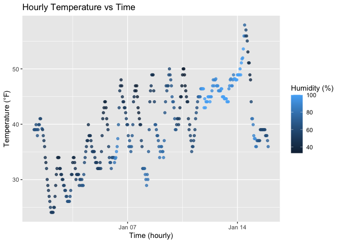

p8105_hw1_jh4977
================
jh4977
2025-09-18

## Problem 1

Firstly, we input the dataset:

``` r
library(moderndive)
data("early_january_weather", package = "moderndive")
```

    Then, we give a short description of the penguins dataset and show variables, size and mean:

    According to the `View()` and `summary()` results, the dataset 
    `early_january_weather` contains 358 
    observations and 15 variables. The 
    variables include weather station origin, date and time information 
    (`year`, `month`, `day`, `hour`, `time_hour`), and several 
    meteorological measurements such as temperature (`temp`), dew point 
    (`dewp`), humidity (`humid`), wind direction (`wind_dir`), wind speed 
    (`wind_speed`), wind gust (`wind_gust`), precipitation (`precip`), 
    pressure (`pressure`), and visibility (`visib`).  

    The mean temperature is about 39.6 °F, with values ranging from 
    24.1 °F to 
    57.9 °F. The 
    mean relative humidity is around 
    65.5%, with 
    observations spanning from 
    32.9% to 
    100%.  

    Wind speed averages about 
    8.2 mph, 
    and visibility is generally high, with a median of 
    10 miles.  
    Data were collected from New York City airports during the first half 
    of January 2013.  

    Next, we should make a scatterplot and save it.


    ``` r
    library(ggplot2)

    p_temp_time <- ggplot(early_january_weather,
                          aes(x = time_hour, y = temp, color = humid)) +
      geom_point(alpha = 0.8) +
      labs(x = "Time (hourly)",
           y = "Temperature (°F)",
           color = "Humidity (%)",
           title = "Hourly Temperature vs Time")

    p_temp_time

<!-- -->

``` r
ggsave("scatterplot_temp_vs_time.png",p_temp_time)
```

    ## Saving 7 x 5 in image

The scatterplot shows that temperature follows a clear daily cycle, with
lower values at night and higher values during the daytime. Over the
first two weeks of January 2013, there is also a general warming trend,
with temperatures gradually increasing after January 6. In addition, the
plot suggests that higher humidity is often associated with lower
temperatures, while lower humidity tends to occur when temperatures are
higher.

## Problem 2

Firstly, create a data frame:

``` r
library(tidyverse)
```

    ## ── Attaching core tidyverse packages ──────────────────────── tidyverse 2.0.0 ──
    ## ✔ dplyr     1.1.4     ✔ readr     2.1.5
    ## ✔ forcats   1.0.0     ✔ stringr   1.5.1
    ## ✔ lubridate 1.9.4     ✔ tibble    3.3.0
    ## ✔ purrr     1.0.4     ✔ tidyr     1.3.1
    ## ── Conflicts ────────────────────────────────────────── tidyverse_conflicts() ──
    ## ✖ dplyr::filter() masks stats::filter()
    ## ✖ dplyr::lag()    masks stats::lag()
    ## ℹ Use the conflicted package (<http://conflicted.r-lib.org/>) to force all conflicts to become errors

``` r
set.seed(123)

normal_sample <- rnorm(10)
logical_vector <- normal_sample > 0
char_vector <- c("A", "B", "C", "D", "E", "F", "G", "H", "I", "J")
factor_vector <- factor(sample(c("L0", "L1", "L2"), 10, replace = TRUE))

df <- tibble(
  Normal_Sample = normal_sample,
  Logical_Vector = logical_vector,
  Char_Vector = char_vector,
  Factor_Vector = factor_vector
)
```

Then,take the mean of each variable in data frame:

``` r
mean(pull(df, Normal_Sample))
```

    ## [1] 0.07462564

``` r
mean(pull(df, Logical_Vector))
```

    ## [1] 0.5

``` r
mean(pull(df, Char_Vector))
```

    ## Warning in mean.default(pull(df, Char_Vector)): argument is not numeric or
    ## logical: returning NA

    ## [1] NA

``` r
mean(pull(df, Factor_Vector))
```

    ## Warning in mean.default(pull(df, Factor_Vector)): argument is not numeric or
    ## logical: returning NA

    ## [1] NA

Mean cannot be calculated: Character Vector: Factor Vector

Mean can be calculated: Normal Sample:0.07462564 Logical vector: 0.5

Finally, we try to convert variables from one type to another:

``` r
logical_numeric <- as.numeric(pull(df, Logical_Vector))
char_numeric <- as.numeric(pull(df, Char_Vector))
```

    ## Warning: NAs introduced by coercion

``` r
factor_numeric <- as.numeric(pull(df, Factor_Vector))

logical_numeric
```

    ##  [1] 0 0 1 1 1 1 1 0 0 0

``` r
factor_numeric
```

    ##  [1] 1 1 1 1 3 2 3 2 1 2

When a logical vector is converted to numeric, TRUE becomes 1 and FALSE
becomes 0, so taking the mean gives the proportion of TRUE values.

For a character vector, conversion to numeric produces NA since
characters have no numeric meaning, so the mean cannot be calculated.

For a factor vector, conversion returns the underlying integer codes of
the levels (e.g., L0=1, L1=2, L2=3); the mean is then computed on these
codes, which do not represent the actual factor levels, so the result is
not meaningful.
